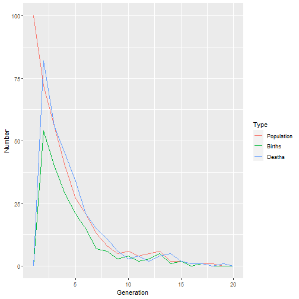

Cell population growth simulation
========================================================
author: Luis Teran 
autosize: true

Objective
========================================================

Full project in:

### <https://luisteran.shinyapps.io/Cell-population-growth-simulation/>.

This is a cell popullation simulator. The main objective is to study population growth given a reproduction and mortality probability.

There's an initial set of individual cells for the simulation  (Initial Population). For every generation, each cell has a fixed probability to reproduce a new individual cell (Reproduction probability %). But also, has a fixed probablity of dying (Mortality probability %). So, the simulation is run for X generatios to simulate the population growth along these generations, and how the probabilities affect it.

Process
========================================================


These parameters are the input for graphic user interface.

```r
initialPop<-100
generations<-20
probChild<-0.5
probDie<-0.8
```

Then for everu generation the probability is evaluated for each cell. Resulting in a new number of total Population

```r
for(i in 1:(generations-1)){
  Births[i+1]<-sum(rbinom(n, 1, probChild))
  Deaths[i+1]<-sum(rbinom(n, 1, probDie))
  n<-n+Births[i+1]-Deaths[i+1]
  Population[i+1]<-n
}
```


Slide With Plot
========================================================


The reproduction probability is evaluated first, so a cell can  reproduce and die in the same. The plot shows the evolutiobn through generation:
- Population (Green Line): Total number of cells
- Births (Blue Line): Number of births for every generation
- Deaths (Yellow Line): Number of deaths for every generation


Slide With Plot
========================================================

Finally, the evolution of the growth presented with the input values is displayed.

